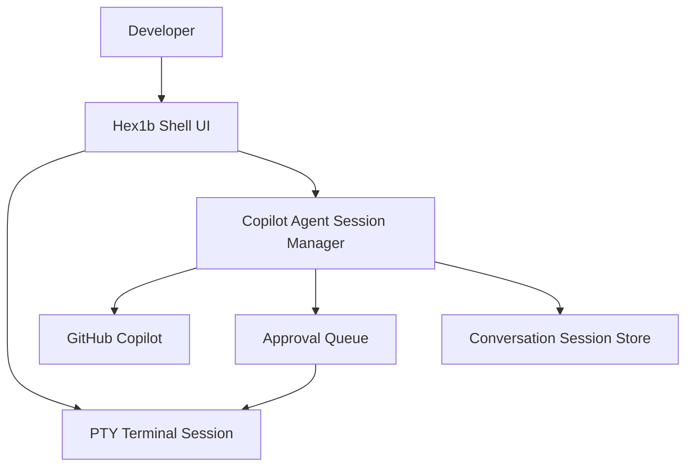
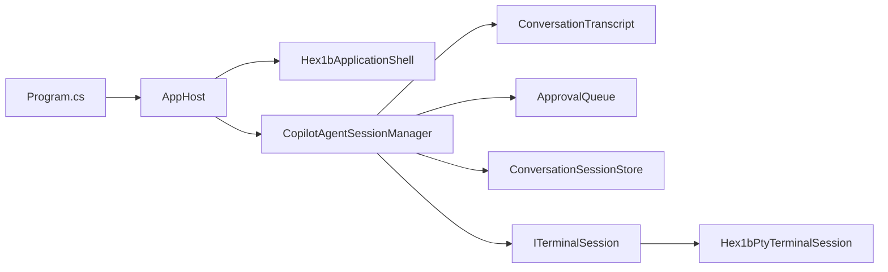
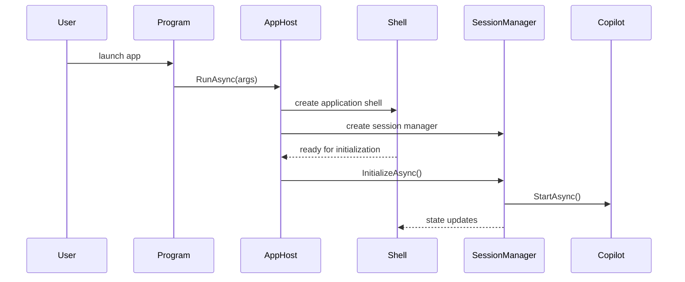
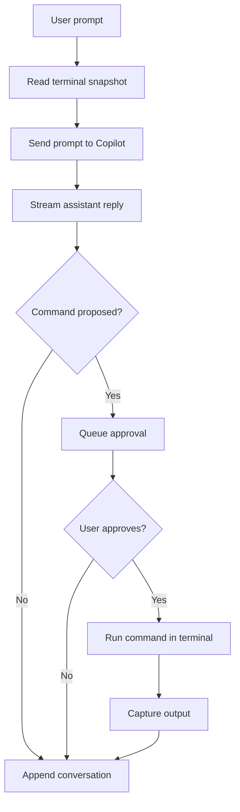
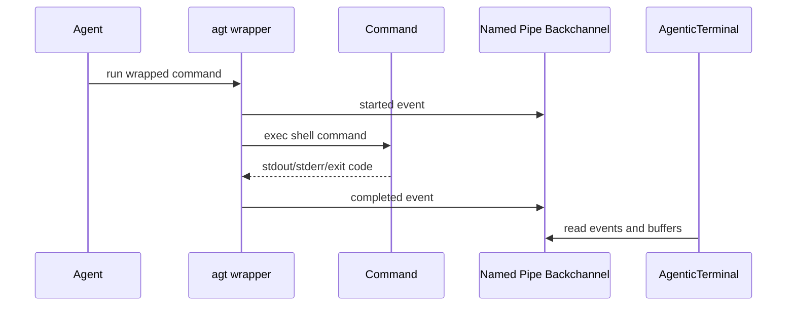

:::deck
title: AgenticTerminal
subtitle: A Copilot-powered terminal workflow built with .NET 10
author: Mats Alritzson
event: .NET User Group
theme: dark
aspect: 16:9
footer: AgenticTerminal · .NET 10 · Hex1b · Avalonia · GitHub Copilot SDK
language: en-US
:::

---
# AgenticTerminal
@id: title
@layout: title
@transition: fade

A terminal-first AI experience for developers who live in the shell.

- Embedded terminal on the left
- Copilot-driven agent workflow on the right
- Human approval for shell command execution
- Conversation persistence across sessions

:::notes
Start with the problem statement: most AI coding tools pull developers out of the terminal. This project keeps the agent in the same workspace.
:::

---
# Why build this?
@id: motivation
@layout: content
@build: by-bullet

- Developers already live in the terminal.
- AI helpers often feel detached from the shell they are supposed to guide.
- Command execution needs an approval boundary.
- We want visibility into what the agent suggests and runs.
- We want a workflow that feels closer to a REPL than to a modal chat app.

:::callout type=info title="Core idea"
Keep the terminal, the agent, and the approval loop in one place.
:::

---
# What the app does
@id: capabilities
@layout: two-column

:::columns
:::left
- Starts an interactive shell session
- Connects to GitHub Copilot through `GitHub.Copilot.SDK`
- Sends prompts with terminal context
- Queues command approvals
- Persists saved conversations
- Supports smoke-test automation
:::
:::right

:::
:::

---
# High-level architecture
@id: architecture
@layout: two-column

:::columns
:::left
## Main areas

- `Agent/`
- `Terminal/`
- `Approvals/`
- `Persistence/`
- `Startup/`
- `UI/`

## Runtime shape

- Hex1b host thread for terminal-first UI
- Avalonia app for companion panel support
- Session manager as the orchestration center
:::
:::right

:::
:::

---
# Startup flow
@id: startup
@layout: content

1. The app resolves whether it should run as the full terminal experience or as the `agt` wrapper.
2. It loads configuration and startup options.
3. It creates the terminal session.
4. It creates `CopilotAgentSessionManager`.
5. It initializes the application shell.
6. It waits for UI readiness, then starts Copilot and loads saved sessions.



---
# Prompt and approval loop
@id: prompt-loop
@layout: two-column

:::columns
:::left
## Prompt path

- User enters a prompt.
- The session manager captures a terminal snapshot.
- Prompt plus context is sent to Copilot.
- Responses stream back into the conversation transcript.

## Approval path

- Agent proposes a shell command.
- The command enters the approval queue.
- The user approves or denies execution.
- Approved commands run in the terminal session.
:::
:::right

:::
:::

---
# Wrapper and backchannel design
@id: backchannel
@layout: content

The wrapper mode exists so the agent can run visible shell commands while still reporting lifecycle events back to the app.

- The wrapper executable name is short and shell-friendly: `agt`
- Backchannel events are defined with protobuf
- Commands can report start and completion details
- Output tails can be queried later for context and diagnostics
- The protocol leaves room for future expansion



---
# UI model
@id: ui
@layout: two-column

:::columns
:::left
## User experience

- Terminal pane on the left
- Agent interaction pane on the right
- Function-key shortcuts for terminal-safe global actions
- Compact approval and status text
- Session list and model picker integrated into the shell UI
:::
:::right
## Technology choices

- .NET 10
- Hex1b for terminal-style UI
- Avalonia for companion UI pieces
- `GitHub.Copilot.SDK` for agent integration
- PTY-backed terminal session support

> The project favors terminal-native interaction over fake modal dialogs.
:::
:::

---
# Persistence and test strategy
@id: quality
@layout: two-column

:::columns
:::left
## Persistence

- Conversations are stored as saved sessions.
- Existing sessions are loaded during startup.
- Session summaries support quick reopening.

## Observability

- Prompt timing is tracked.
- Tool activity is surfaced.
- Smoke-test mode validates startup and basic agent behavior.
:::
:::right
## Testing

- xUnit test project
- terminal capture parsing tests
- PTY integration tests with a fake host
- startup and configuration tests
- persistence tests
- UI formatting tests
- interaction automation tests
:::
:::

---
# Interesting .NET choices
@id: dotnet
@layout: content

- Uses `net10.0` and modern C# features.
- Blends terminal UI and desktop UI in one application.
- Uses async orchestration heavily across startup, prompts, approvals, and terminal execution.
- Uses generated protobuf types for the command backchannel.
- Keeps the domain split into focused folders rather than one large service class.

```csharp
await using var sessionManager = new CopilotAgentSessionManager(
    approvalQueue,
    conversationSessionStore,
    terminalSession,
    Environment.CurrentDirectory,
    options.CopilotModel,
    new CopilotSessionOptions(...));
```

---
# Current challenges and lessons learned
@id: lessons
@layout: content
@build: by-bullet

- Terminal-first UX is powerful, but cross-thread UI updates require discipline.
- Input handling is harder than it looks, especially around dead keys and composed input.
- Approval UX must stay fast without hiding important command details.
- AI integration needs strong fallback paths, timeouts, and transparent status text.
- Testability improves when terminal, persistence, and startup concerns are abstracted early.

:::notes
Mention the recent collection-modified issue as an example of why thread ownership and snapshots matter in mixed-UI architectures.
:::

---
# Where this could go next
@id: roadmap
@layout: content

- Richer REPL-style history interaction
- More polished model selection and quota insights
- Expanded backchannel protocol for pipeline reporting
- Better diagnostics around terminal and agent timing
- More cross-platform terminal hosting options
- Packaging for easier community adoption

---
# Takeaways
@id: close
@layout: section

- AI workflows get better when they stay close to the developer's real environment.
- .NET is a strong fit for combining terminal integration, desktop UI, async orchestration, and testing.
- AgenticTerminal is a practical experiment in keeping humans in control while still benefiting from agent assistance.

Thank you.

## Discussion topics

1. How much approval should an agent need?
2. What makes a terminal-native AI UX feel trustworthy?
3. Where would you take this architecture next?
