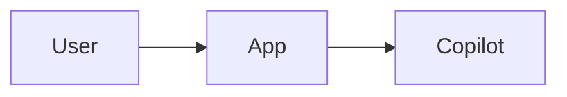
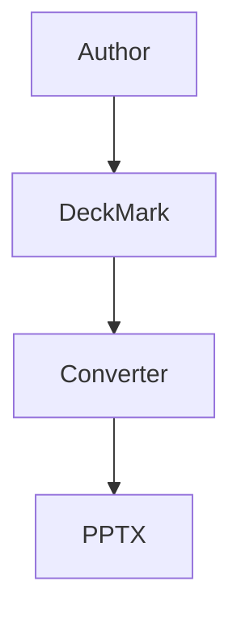

# DeckMark

DeckMark is a slide-oriented markup language for presentations that need to stay easy to author in plain text and easy to convert to PowerPoint with a simple script.

## Design goals

- Keep the source human-readable.
- Reuse familiar Markdown syntax.
- Make slide boundaries explicit.
- Support Mermaid diagrams as first-class content.
- Add only a small set of directives for slide metadata and layout.
- Keep parsing deterministic enough for a straightforward .NET, Python, or PowerShell converter.

## File extension

Use `.deck.md` for presentation files.

## Document structure

A DeckMark file has:

1. A required deck header.
2. One or more slides.
3. Standard Markdown content plus a few block directives.

### Deck header

The file starts with a `:::deck` block containing key/value metadata.

```text
:::deck
key: value
key: value
:::
```

Supported deck keys:

- `title`
- `subtitle`
- `author`
- `event`
- `theme`
- `aspect`
- `footer`
- `language`
- `company`

Example:

```text
:::deck
title: AgenticTerminal
subtitle: A Copilot-powered terminal for .NET
author: Your Name
event: .NET User Group
theme: dark
aspect: 16:9
footer: AgenticTerminal · .NET 10 · GitHub Copilot SDK
language: en-US
:::
```

## Slide boundaries

Each slide starts with a line containing only:

```text
---
```

The first level-1 heading after `---` is the slide title.

```text
---
# Slide title
```

## Slide directives

Optional slide directives appear immediately after the slide title.

```text
@id: architecture
@layout: two-column
@background: dark
@transition: fade
```

Supported slide keys:

- `@id`
- `@layout` (`title`, `content`, `two-column`, `section`, `comparison`, `image-right`)
- `@background`
- `@transition`
- `@build` (`all-at-once`, `by-paragraph`, `by-bullet`)
- `@footer`

## Content rules

DeckMark uses normal Markdown for most content.

Supported content types:

- headings
- paragraphs
- bullet lists
- numbered lists
- block quotes
- tables
- fenced code blocks
- Mermaid fenced blocks
- images using standard Markdown image syntax

### Speaker notes

Use a `:::notes` block anywhere inside a slide.

```text
:::notes
Talk track or reminders for the presenter.
This content is not rendered on the slide.
:::
```

### Columns

Use a `:::columns` block with `:::left` and `:::right` child blocks.

```text
:::columns
:::left
Left column content.
:::
:::right
Right column content.
:::
:::
```

For three columns, use `:::center` as an additional child block.

### Callouts

Use `:::callout` for emphasized text.

```text
:::callout type=info title="Key point"
The agent stays in the same terminal workflow as the user.
:::
```

Supported `type` values:

- `info`
- `success`
- `warning`
- `danger`

### Mermaid diagrams

Use a fenced code block with the `mermaid` language tag.

````text

````

Converter expectation:

- Render Mermaid to SVG or PNG before inserting into PowerPoint.
- Size the rendered diagram to the current placeholder or content box.

### Code blocks

Use standard fenced code blocks.

````text
```csharp
var app = new Hex1bApp(...);
```
````

Converter expectation:

- Preserve monospaced font.
- Keep line breaks.
- Optionally apply syntax highlighting.

### Images

Use Markdown image syntax with optional size hints in braces.

```text
{width=80%}
```

Supported image attributes:

- `width`
- `height`
- `align`

## Suggested PowerPoint mapping

- Deck header -> presentation metadata and theme selection.
- `---` -> new slide.
- `# Title` -> slide title placeholder.
- Markdown body -> body placeholder content.
- `@layout` -> slide layout selection.
- `:::columns` -> side-by-side content placeholders.
- `:::notes` -> speaker notes.
- ` ```mermaid ` -> rendered diagram inserted as an image.
- fenced code -> formatted text box.
- tables -> native table or positioned text boxes.
- images -> inserted pictures.

## Minimal example

```text
:::deck
title: Sample Deck
author: Demo User
theme: dark
aspect: 16:9
:::

---
# Welcome
@layout: title

A short subtitle line.

:::notes
Open with a one-minute overview.
:::

---
# Architecture
@layout: two-column

:::columns
:::left
- Fast to author
- Easy to parse
:::
:::right

:::
:::
```

## Parsing guidance

A converter can parse DeckMark in this order:

1. Read the `:::deck` header block.
2. Split the remainder of the file on top-level `---` separators.
3. For each slide:
   - read the first `#` heading as the title
   - read consecutive `@key: value` lines as slide metadata
   - parse the body as Markdown plus custom block directives
4. Render Mermaid blocks before generating slides.
5. Map notes separately from visible content.

## Why this format works well

- Authors can write slides without learning a verbose schema.
- Scripts can parse it with line-based rules before handing the body to a Markdown processor.
- Mermaid support is natural because it reuses fenced blocks.
- The format stays source-control friendly.
